# Architecture-Android

# 功能介绍

- 支持**配置变更**后的还原
  - **屏幕旋转**
  - **亮暗主题**切换
  - **语言**切换（国际化）
  - **字体大小**更改
  - **分屏**
  - **...**
- 支持**进程杀死**后的还原
- 支持**多App开发**
- 支持一键**切换Feature模块单独运行**
- 支持一键**去除无用功能代码**
- 支持项目**无反射**实现
- 支持**EdgeToEdge**
- 支持**动态主题**（`Android13`+）
- 支持**刷新、自动加载**


本项目为一个**Android架构**，它遵循 **Android 设计**和**开发最佳实践**，旨在为开发者**提供实用参考**。

本项目**目标**是为了**同时**支持`Compose`和`View`，以支持目前现有的`View`代码，目前本项目**仅**`View`实现，后续会支持`Compose`。

本项目是以**字节跳动**公司的**抖音**App为参考，模拟开发的**抖音**App。由于本项目，**无抖音真正的网络数据**，所以本项目使用的数据，是使用通过某些**开源API**网络接口，**模拟**转的**网络数据**。


欢迎大家一起来**维护**项目，使其功能更加的**强大**、**健硕**。有问题，有需求，请提[issue](https://github.com/zrq1060/architecture-android/issues/new)，或者私信我。

**欢迎大家点赞、收藏，以方便您后续查看。**


## 下载

[Apk下载](https://github.com/zrq1060/architecture-android/blob/master/docs/images/apk/app-release.apk)

**扫码下载**


## 截图

### App展示


| 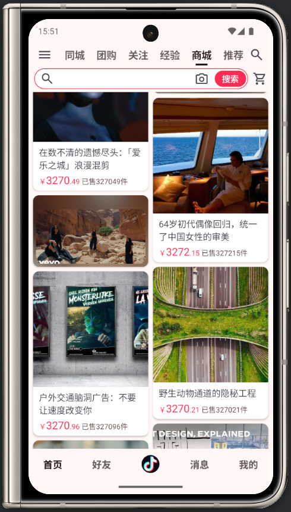 |  |  |
| ------------------------------------------------------ | ------------------------------------------------------ | ------------------------------------------------------ |

### 主题展示


|    Themes    |                                Light                                |                                Dark                                |
| :-----------: | :------------------------------------------------------------------: | :----------------------------------------------------------------: |
| **抖音主题** |   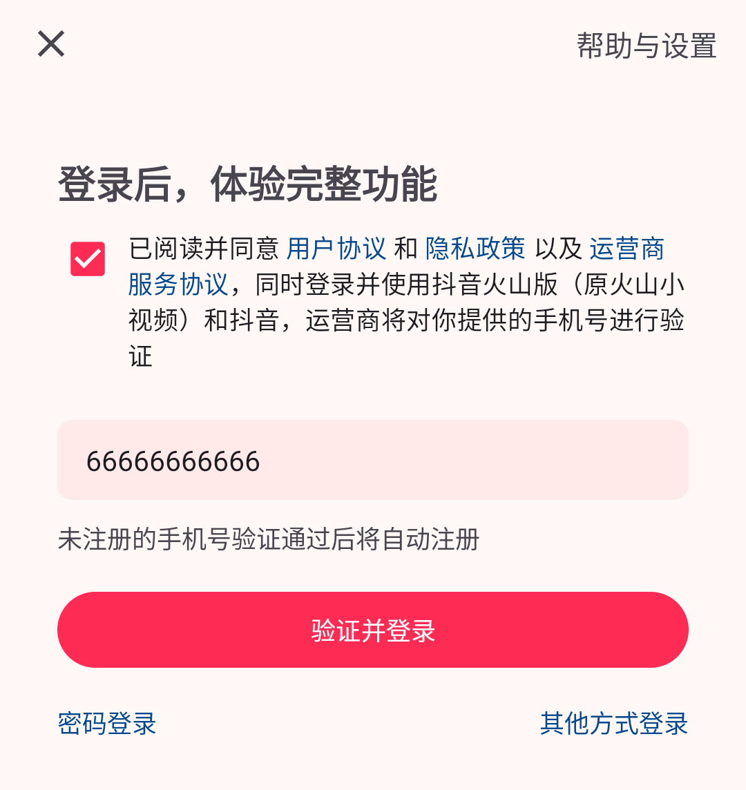   |   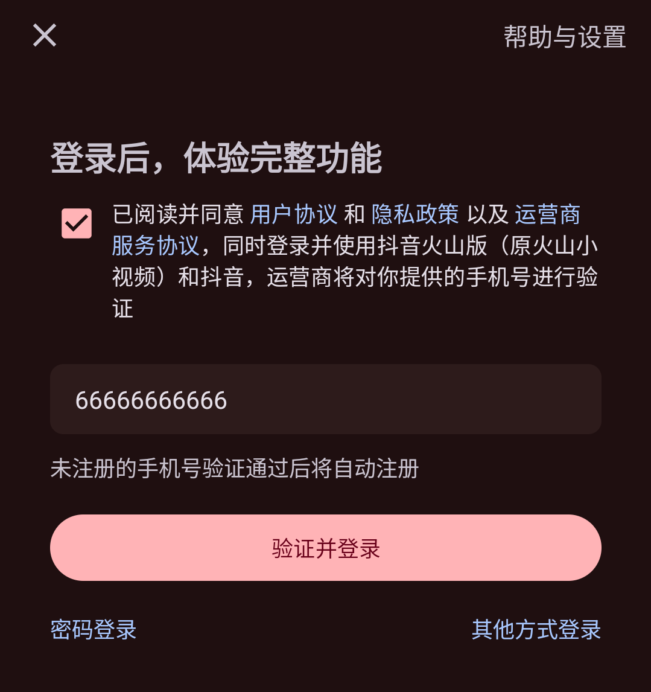   |
| **动态主题1** | 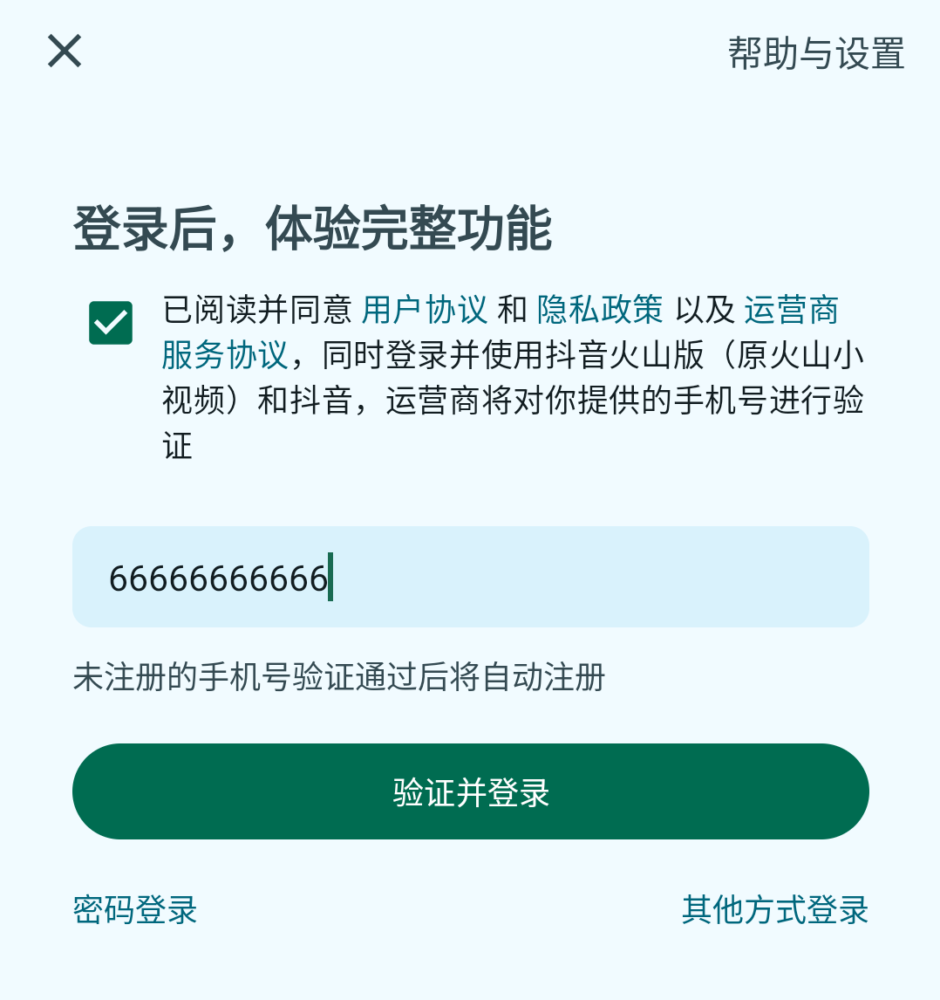 | 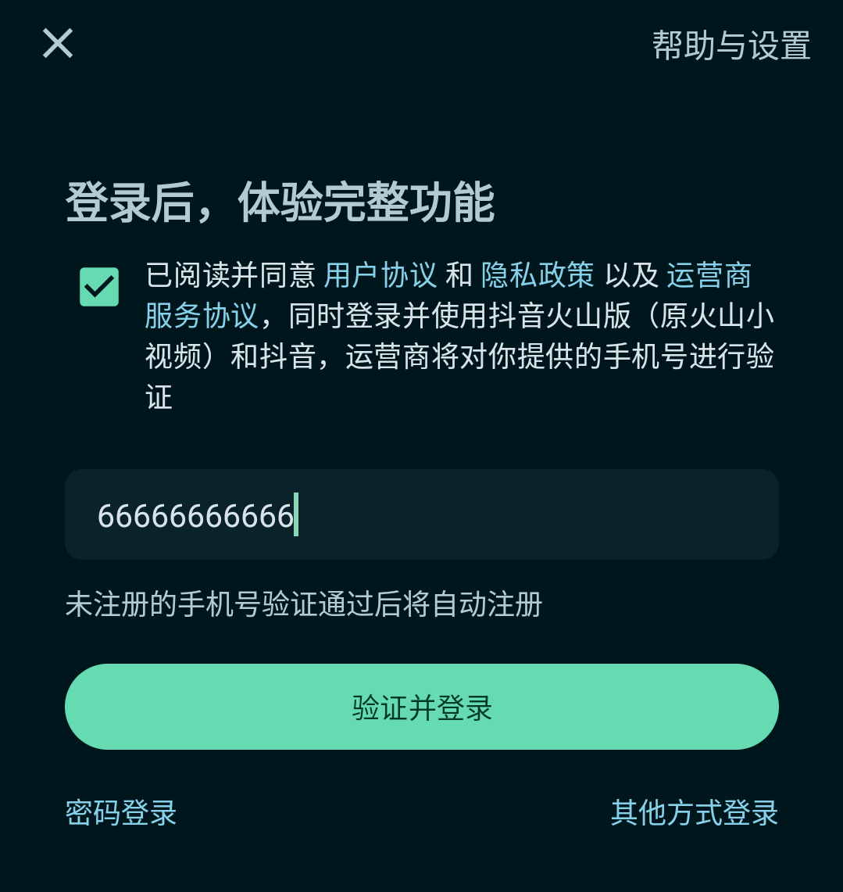 |
| **动态主题2** | 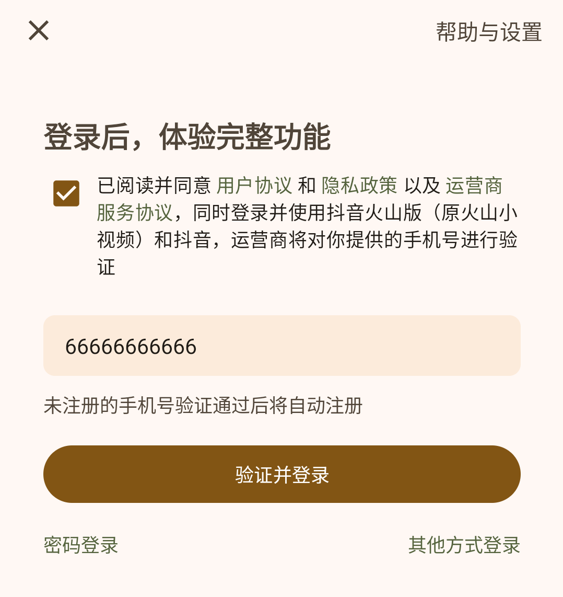 | 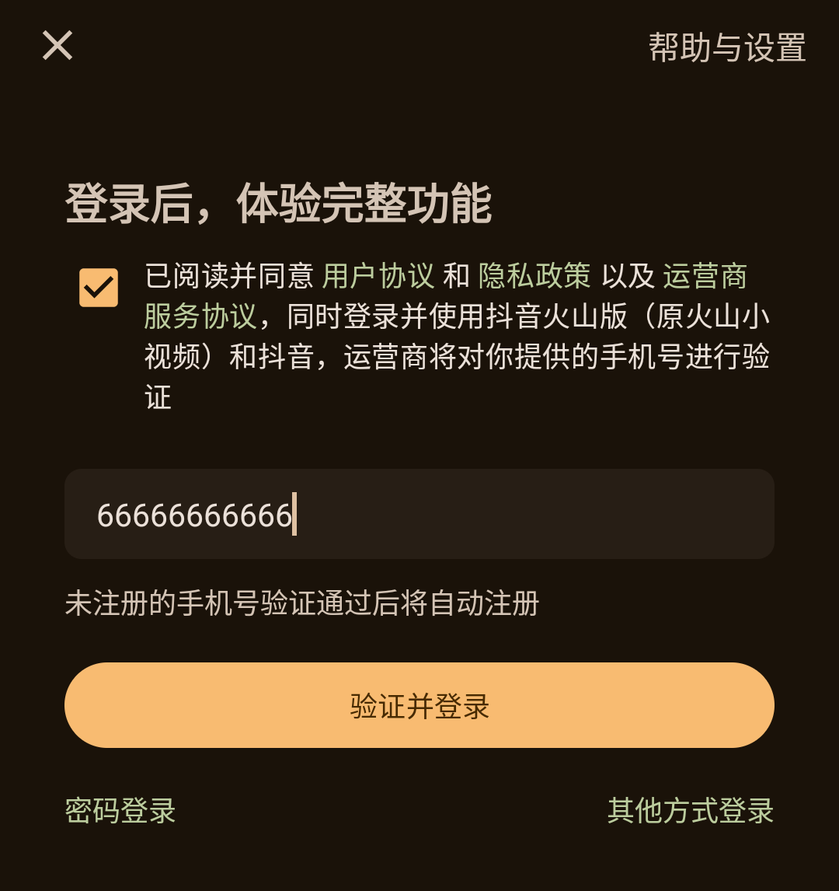 |

# 快速介绍

## 下载

**下载上面App包**，或者**下载项目并运行**。

```
git clone git@github.com:zrq1060/architecture-android.git
```

## 功能演示

> 说明：本项目**任何**页面，都支持**配置变更后的还原**（屏幕`旋转`、`亮暗模式`切换、`语言`切换、`字体大小`更改、`分屏`等）、**进程被杀死后的还原**（可打开，开发者选项-后台进程限制-不允许后台进程，以更好的测试进程被杀死。开启后，可在后台多打开一些无关的app，再切换打开此app即可演示此效果）。

本项目，目前仅支持如下功能：

- **登录页**：登录账号（手机号、邮箱）为**任意**，登录密码（验证码、密码）为**123456**。**可断网**，或输入**错误密码**，查看页面效果。

- **Home首页**：顶部栏目的排序（长按首页顶部栏目）

- **Main主页**：好友、商场栏目的切换（长按主页底部栏目第2个）

- **Shop商城页**：支持刷新、自动加载，点击条目模拟的**增、删、改**操作。**可断网**，查看页面效果。

  

**建议在此跟着操作App，以演示验证上面功能效果。**


## 单独运行Feature模块演示

1、修改项目根目录下`gradle.properties`内`isFeatureSingle`为`true`，并`Sync`同步`Gradle`。

```groovy
isFeatureSingle = true
```

2、执行**安装全部命令**

点击右侧`Gradle`-`Tasks`-`install`-`installDebug`，或执行如下命令：

```groovy
.\gradlew installDebug
```

3、执行完后，会在桌面出现**所有Feature模块**的App（如下图所示），点击即可测试某单个**Feature**模块。

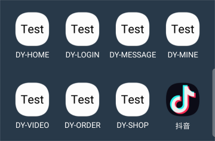

# 详细介绍

本项目是以**字节跳动**公司，**抖音**项目为基准，进行的架构设计开发。

## 模块间架构

在不断变大的代码库中，**可扩缩性**、**可读性**和**整体代码质量**通常会随着时间的推移而降低。这是因为代码库在不断变大，而其维护者未采取积极措施来保持易于维护的结构。**模块化**是一种行之有效的代码库构建方法，可帮助改善可维护性并避免此类问题。

> **模块化**相关请看官方的 [Android 应用模块化指南](https://developer.android.com/topic/modularization)

### 模块划分

#### 标准版

官方的**模块化**完成后，**模块图（部分模块）** 如下：

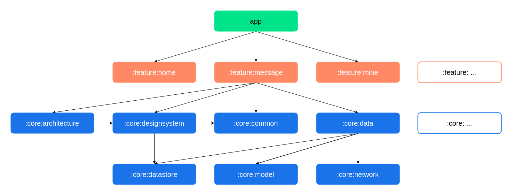

**模块说明：**

* `app`模块：`app`模块依赖于所有的`feature`模块和必需的`core`模块。
* `feature:`模块：`feature`模块不应该依赖于其他的`feature`模块，它们只依赖于所需的`core`模块。
_* `core:`模块：`core`模块可以依赖于其他`core`模块，但它们不应该依赖于`feature`模块或`app`模块。_

项目的**目录图**如下：

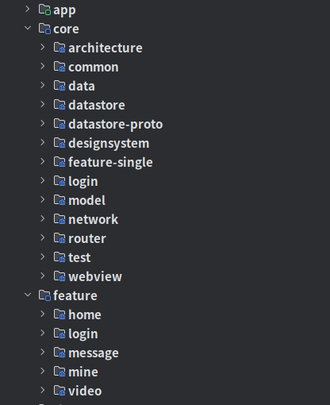

#### 多App版

一般一个公司并非一个App，比如商城功能App（一个用户端、一个商家端）、外卖功能App（一个用户端、一个骑手端）。以**字节跳动**公司为例子，其中公司开发的App有**抖音**、**西瓜视频**、**今日头条**、**飞书**、**剪映**等。 

上面**标准**的**模块**划分，内部的`core`模块，内部含有**本App特有**的、**通用**的代码或资源，适用于**单App**架构。如果要适用**多App**架构，就需要把上面的`core`模块内**通用部分**提取出来，提取后的**目录图**如下：

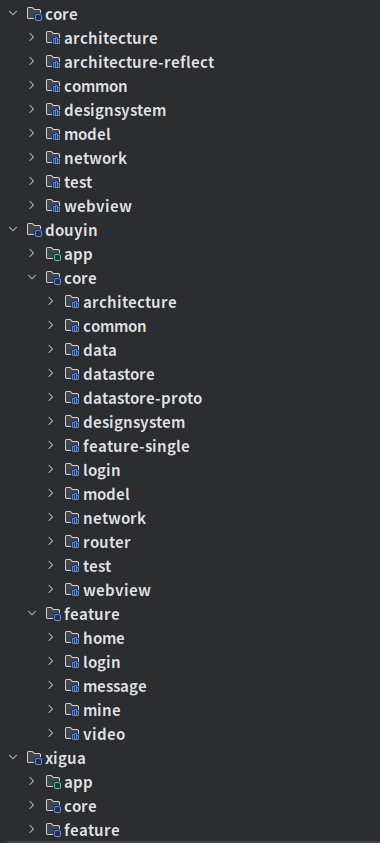

**目录说明：**

* 最外层`core`目录：为**所有App**都可以使用的代码，**内部模块**被**所有App**内的`core`模块依赖。

* 最外层`douyin`目录：为**抖音**App自己独有（特有）的相关代码。

  * `core`模块：依赖**最外层**`core`目录内的模块。
  * `app`模块、`feature`模块：直接依赖**内部**`core`模块即可，如：`:douyin:app`模块直接依赖`:douyin:core:architecture`模块即可。此模块为**抖音**App对通用**架构**模块的**定制**，它会依赖**通用**的`:core:architecture`模块。

* 最外层`xigua`目录：为**西瓜视频**App的相关代码，规则同上（抖音）。

  

> 说明：还可以在最外层继续开发其他App，如**今日头条**、**飞书**、**剪映**等，规则同上（抖音、西瓜视频）。


#### 可移除版

在项目开发过程中，如果你不看好要开发的功能，或者领导或者产品告诉你，要开发的功能之后可能会移除，你可以使用此设计。

以**抖音**App为例，最早的**抖音**是没有**商城**功能的，如果以**商城**功能之后会**移除**来开发，你可以使用以下模块设计。

**目录图**如下：

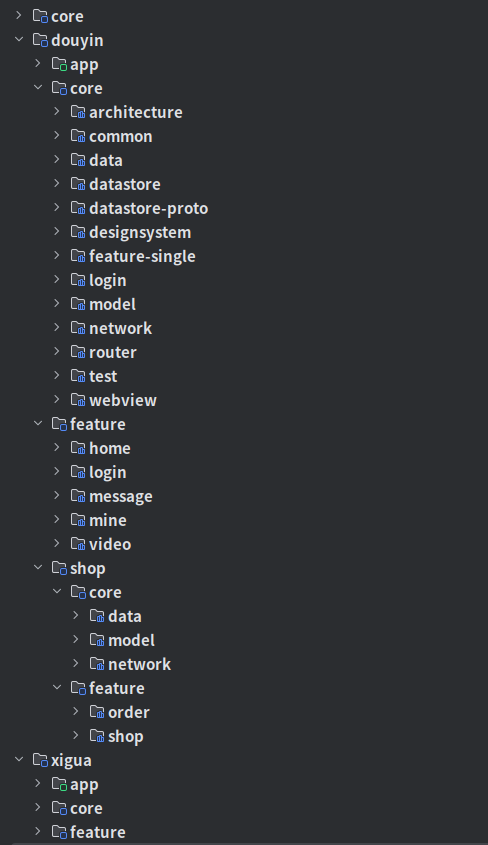


**shop目录说明：**

* `core`模块：可以依赖**抖音**`core`内的模块，但反之不行。
* `feature`模块：规则不变，同**抖音**`feature`。

可以修改项目根目录下`gradle.properties`内`isShopInclude`为`false`、`isRouterReflect`为`true`，来演示此**移除功能**。

```groovy
isShopInclude = false
isRouterReflect = true
```

> 说明：
>
> `isShopInclude`：为是否**包括商城**。
>
> `isRouterReflect`：为是否`Router`**反射实现**。 
>
> - 本项目`Router`实现分为了两种，**Dagger实现**（**正式**环境用）、**反射实现**（**测试**环境用），详细看`router`模块。
> - 如果**包括**商城，`Router`的实现可以任意。如果**不包括**商城，`Router`使用**Dagger**实现，会导致App调用**商城代码**时**崩溃**，需要把App调用**商城代码**的调用**移除后**才能正常；`Router`使用**反射**实现，不会导致调用异常，而是如果没有找到目标会使用**假的**的**FakeXXXRouter**的实现，详细看`router`模块。

### 模块包名

包名格式一般为：**域名反转+项目名+功能名**，以此**字节跳动**（域名：www.bytedance.com ）公司**抖音**项目为例，规则如下：

* `core`：**com.bytedance.core.xxx**，如：`architecture`模块：com.bytedance.core.architecture
* `douyin`：**com.bytedance.douyin.xxx**
  * `app`：com.bytedance.douyin
  * `core`：com.bytedance.douyin.**core**.xxx，如：`architecture`模块：com.bytedance.douyin.core.architecture
  * `feature`：com.bytedance.douyin.**feature**.xxx，如：`home`模块：com.bytedance.douyin.feature.home
  * `shop`：**com.bytedance.douyin.shop.xxx**
    * `core`：com.bytedance.douyin.shop.**core**.xxx，如：`data`模块：com.bytedance.douyin.shop.core.data
    * `feature`：com.bytedance.douyin.shop.**feature**.xxx，如：`shop`模块：com.bytedance.douyin.shop.feature.shop

* `xigua`：规则同上（抖音）


### 模块功能

使用上述模块化策略，项目具有以下模块：

* `app`：项目的入口，含有`MainActivity`、`Application`等。
* `core`

  * `architecture`：架构相关，包含一些基础类，如：`:core:architecture`模块包含通用的`BaseViewsActivity`、`BaseViewsFragment`等，`:douyin:core:architecture`模块**抖音**定制的`AppViewsActivity`、`AppViewsFragment`等。
  * `architecture-reflect`：架构反射实现相关，包含一些架构内的反射实现，如：`reflectInflateViewBinding`（反射实现`ViewBinding`）、`reflectViewModels`（反射实现`ViewModel`）。目前**抖音**项目，默认是不使用反射相关代码，所以未使用此反射库，可在其`AppViewsActivity`、`AppViewsFragment`内对架构定制使用。
  * `common`：通用相关，包含一些通用类、工具类等。
  * `designsystem`：设计系统相关，包含控件、主题等。
  * `model`：`Model`类相关，包含`Model`类等。
  * `network`：网络相关，包含`NetworkDataSource`、网络工具类、图片加载等。
  * `test`：测试页面相关（为了给未实现的功能，占位用），包含`TestActivity`、`TestFragment`等。
  * `webview`：网页相关，包含网页的跳转、配置等。
  * `data`：数据相关，包含`Repository`类等。
  * `datastore`：`DataStore`存储相关，包含`PreferencesDataSource`等。
  * `datastore-proto`：`DataStore`的`proto`配置相关，包含`user.proto`配置等。
  * `feature-single`：单独模块运行通用配置相关，包含`TestFragmentDetailsAndroidEntryPointActivity`等。
  * `login`：登录相关，包含登录检测、当前登录状态、退出登录等。
  * `router`：路由系统相关，包含`Router`的**Dagger实现**、**反射实现**等。
* `feature`：功能业务，包含UI、`ViewModel`等。


### Feature模块间通信

`Feature`模块间通信，使用`router`模块的`Router`类进行通信，以`home`模块为例规则如下：

#### 定义

```kotlin
interface HomeRouter {
    fun createHomeFragment(): Fragment
}
```

此`HomeRouter`接口为`home`模块**对外暴露**的**可供其他调用**部分，在`router`模块内定义，如果还有其他的，可继续在此接口内添加，如：`createXXXFragment`、`startXXXActivity`方法等。

#### 真的实现

```kotlin
class DefaultHomeRouter : HomeRouter {
    override fun createHomeFragment(): Fragment = HomeFragment.newInstance()
}
```

此`DefaultHomeRouter`类为`HomeRouter`接口**真的实现**，在`home`模块内实现。

#### 假的实现

```kotlin
class FakeHomeRouter : HomeRouter {
    override fun createHomeFragment(): Fragment = AppTestFragment.newInstance("Home")
}
```

此`FakeHomeRouter`类为`HomeRouter`接口**假的实现**，在`router`模块的`router-reflect`内实现，内部使用的`AppTestFragment`仅是为了测试占位用。

> 说明：
>
> Router使用**Dagger实现**：使用`Dagger`找`HomeRouter`的实现（`DefaultHomeRouter`），如果找不到**会报错**。
>
> Router使用**反射实现**：使用**反射**直接找`DefaultHomeRouter`，如果找不到会直接使用`FakeHomeRouter`，**不会报错**。

#### 调用

```kotlin
Router.Home.createHomeFragment()
```


### 单独运行Feature模块

如果你只负责某个`Feature`模块，或者想更干净、更快的测试你的功能，你可以使用此，步骤如下：

**1、** 修改项目根目录下`gradle.properties`内`isFeatureSingle`为`true`，并`Sync`同步`Gradle`。

```groovy
isFeatureSingle = true
```

> 说明：
>
> `isFeatureSingle`：为是否**单独运行Feature模块**。如果为`true`，则`Router`默认使用**反射实现**。

**2、** 添加测试入口点

使用[TestPoint](https://github.com/zrq1060/TestPoint)库，用以下**两种方式**，添加测试入口点，详细使用看[TestPoint](https://github.com/zrq1060/TestPoint)。

**微侵入（使用简单）：**

在目标类上添加`TestEntryPoint`注解，如`ShopFragment`：

```kotlin
@TestEntryPoint("商城")
class ShopFragment{

}
```

**零侵入（使用复杂）：**

在`Feature`模块下的`feature-single`内，添加如下**定制**跳转类，如在`shop`模块`feature-single`内添加。

```kotlin
@TestEntryPointListFragment
class MyTestListFragment : TestListFragment() {

    override fun onAddTestItems() {
        super.onAddTestItems()
        addItem("商城-无参", ShopFragment::class.java)
        addItem("商城-有参", ShopFragment::class.java, ARGUMENTS_KEY_TOP_EXTRA_HEIGHT to 100) // 参数：额外的高
        addItem("跳转Login页面-Router") {
            // 如果没有引用feature:login模块，则会打开假的占位页面。
            Router.Login.startLoginActivity(requireActivity())
        }
    }
}
```

**3、** 运行

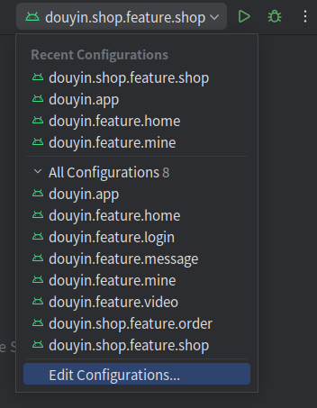

选择上面的一个，并运行，如：选择`douyin.shop.feature.shop`，则运行商城功能。

## 模块内架构

### 官方架构

使用官方[推荐架构](https://developer.android.com/topic/architecture#recommended-app-arch)，有助于构建强大而优质的应用。

> **应用架构**相关请看官方的 [应用架构指南](https://developer.android.com/topic/architecture)

官方的**架构概述图** 如下：

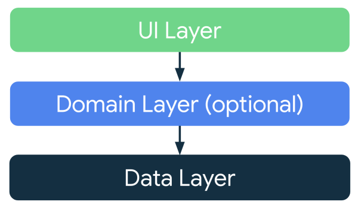


### 项目架构

本项目，目前没有使用`Domain`层，也没有使用`Room`，**架构图** 如下：

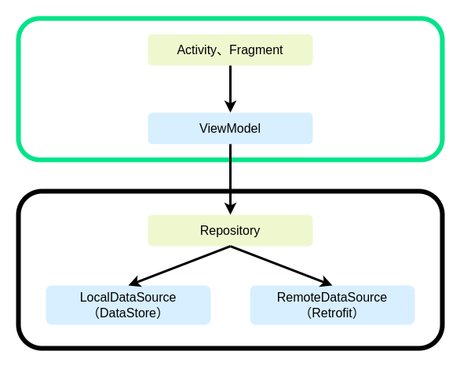


### 使用

**Fragment**

```kotlin
package com.bytedance.douyin.shop.feature.shop.ui

import android.view.LayoutInflater
import android.view.ViewGroup
import androidx.fragment.app.viewModels
import com.bytedance.douyin.core.architecture.app.views.AppViewsFragment
import dagger.hilt.android.AndroidEntryPoint
import com.bytedance.douyin.shop.feature.shop.databinding.DouyinShopFeatureShopFragmentShopBinding as ViewBinding
import com.bytedance.douyin.shop.feature.shop.ui.ShopUiState as UiState
import com.bytedance.douyin.shop.feature.shop.ui.ShopViewModel as ViewModel


@AndroidEntryPoint
class ShopFragment : AppViewsFragment<ViewBinding, UiState, ViewModel>() {
    override val viewModel: ViewModel by viewModels()

    override fun inflateViewBinding(
        inflater: LayoutInflater,
        container: ViewGroup?,
    ) = ViewBinding.inflate(inflater, container, false)

    override fun ViewBinding.initViews() {

    }

    override fun ViewBinding.initListeners() {

    }

    override fun ViewBinding.initObservers() {
    }

    override fun ViewBinding.onUiStateCollect(uiState: UiState) {
    }

    companion object {
        internal fun newInstance() = ShopFragment()
    }
}
```

> 说明：
>
> 1. `Fragment`直接继承`AppViewsFragment`，此类为**抖音**项目对`BaseViewsFragment`的定制。
> 2. `ViewModel`、`ViewBinding`的创建由于本项目没有使用反射，所以需要在每个子类中自己实现，可以在`AppViewsFragment`内使用`reflectInflateViewBinding`、`reflectViewModels`反射实现，这样就可以在每个子类中省略`ViewModel`、`ViewBinding`的创建。
> 3. 初始化方法，使用`ViewBinding`扩展方法，是为了能
> 3. 让其在方法内直接获取到`xxx`控件，而不用通过`binding.xxx`获取，以方便更好的设置控件。
> 4. `XXXBinding`、`XXXUiState`、`XXXViewModel`，全部通过**as别名**来命名，统一了代码**一致性**。

**ViewModel**

```kotlin
package com.bytedance.douyin.app.main

import com.bytedance.douyin.core.architecture.app.AppViewModel
import com.bytedance.douyin.core.data.repository.interfaces.MainRepository
import dagger.hilt.android.lifecycle.HiltViewModel
import kotlinx.coroutines.flow.Flow
import kotlinx.coroutines.flow.map
import javax.inject.Inject
import com.bytedance.douyin.app.main.MainUiState as UiState


@HiltViewModel
class MainViewModel @Inject constructor(
    mainRepository: MainRepository,
) : AppViewModel<UiState>() {

    override val uiStateInitialValue: UiState = UiState()

    override val uiStateFlow: Flow<UiState> = mainRepository.getMainTabsStream().map {
        UiState(tabs = it)
    }
}

// Main-UiState
data class MainUiState(
    val tabs: List<MainTabsItem>? = null,
)
```

> 说明：
>
> 1. `ViewModel`直接继承`AppViewModel`，此类为**抖音**项目对`BaseViewModel`的定制。
> 2. `uiStateInitialValue`为`UiState`的初始化值，一般为默认的`UiState`对象。
> 3. `uiStateFlow`为`UiState`的`Flow`流，它变化会影响到`Activity`、`Fragment`的`onUiStateCollect`，一般为`Repository`流转`UiState`。
> 4. `XXXUiState`，通过**as别名**来命名，统一了代码**一致性**。


# 未来支持

- 支持**Compose**
- 优化**是否Login**相关逻辑
- 优化**WebView**相关逻辑

# 其他

## 三方库

### 自己

- [TestPoint](https://github.com/zrq1060/TestPoint)
- [SpanBuilder](https://github.com/zrq1060/SpanBuilder)

### 三方

- [Retrofit](https://github.com/square/retrofit)
- [Glide](https://github.com/bumptech/glide)
- [BaseRecyclerViewAdapterHelper](https://github.com/CymChad/BaseRecyclerViewAdapterHelper)
- [SmartRefreshLayout](https://github.com/scwang90/SmartRefreshLayout)
- [MagicIndicator](https://github.com/hackware1993/MagicIndicator)

## 参考

- [nowinandroid](https://github.com/android/nowinandroid)
- [architecture-samples](https://github.com/android/architecture-samples)

 

**欢迎大家点赞、收藏，以方便您后续查看。**

